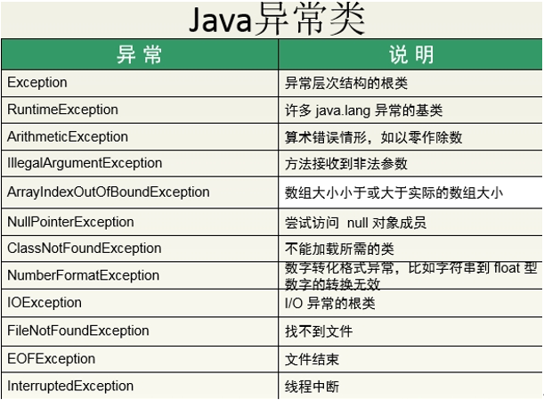

# 异常类的分类

> java异常体系

Throwable是异常和错误的顶层父类，其中error的发生都属于系统级别，解决错误的方案一般是修改源代码。

程序的异常一般是因为程序在操作数据时引发的，解决异常的方案是：声明、捕获（学习以Exception为主，开发也主要以Exception为主）



运行时异常：RuntimeException

编译时异常：Exception

# 异常的处理

声明：其实就是程序中遇到异常时，自己不处理，交给其它程序处理

关键字：throws

捕获：其实就是在程序中遇到异常时，不会交给其它程序处理，自己处理

关键字：try 、catch、finally

注意：1，在使用throw抛出异常代码的后面，不能书写任意代码。

   2，如果使用try...catch...finally结构的，catch中抛出异常后面如果有其他语句，执行时先执行finally语句再去执行catch中的其他语句

   3，try..catch..catch结构中必须按照子类到父类的顺序写

# 自定义异常

当开发时，项目中出现了java中没有定义过的问题时，这时就需要我们按照java异常建立思想，将项目的中的特有问题也进行对象的封装。这个异常，称为自定义异常。

自定义异常的步骤：

1)定义一个子类继承Exception或RuntimeException，让该类具备可抛性。

2)通过throw 或者throws进行操作。

> 自定义一个异常类

```java
package com.zz;
/*
    自定义注册异常，继承RuntimeException
 */
public class RegistException extends RuntimeException {
    //定义无参构造方法
    public RegistException() {
        super();
    }

    //定义有参构造方法
    public RegistException(String message) {
        super(message);
    }
}

```

> 对异常类的使用

```java
package com.zz;

import java.util.Scanner;
/*
    对自定义异常RegistException的使用
 */
public class DemoRegistException {
    //数据库用户名
    static String[] userNames={"张三","李四","王五"};
    public static void main(String[] args) {
        //输入注册的用户名
        System.out.println("请输入用户名：");
        Scanner sc=new Scanner(System.in);
        String username = sc.next();

        //循环遍历userNames数组，查询用户名是否已经存在
        for (String name : userNames) {
            //如果存在，抛出异常，中断程序
            if (name.equals(username)){
                throw new RegistException("用户名已经存在");
            }
        }
        //如果不存在，输出注册成功
        System.out.println("注册成功");
    }
}

```


异常的转换思想：当出现的异常是调用者处理不了的，就需要将此异常转换为一个调用者可以处理的异常抛出。

# Java中try()catch{}的使用方法

> 今天在总结IO的时候，看到一段代码如下

```java
	try (Socket cSocket = new Socket(InetAddress.getLocalHost(), port)) {
            BufferedReader bufferedReader = new BufferedReader(new 												InputStreamReader(cSocket.getInputStream()));
            bufferedReader.lines().forEach(s -> System.out.println("客户端：" + s) );
        } catch (UnknownHostException e) {
            e.printStackTrace();
        } catch (IOException e) {
            e.printStackTrace();
        }
```

和平常见的不一样，我们平常见的是这样的

```java
	try{
        fis=new FileInputStream("src\\com\\ggp\\first\\FileInputStreamDemo.java");
        byte[]bbuf=new byte[1024];
        int hasRead=0;
        while((hasRead=fis.read(bbuf))>0){
      
        System.out.println(new String(bbuf,0,hasRead));
 
        }
 
        }catch(IOException e){
        e.printStackTrace();
        }finally{
        try {
             fis.close();
             } catch (IOException e) {
             // TODO Auto-generated catch block
             e.printStackTrace();
            }
 
        }
```

- 如果{}中的代码块出现了异常，会被catch捕获，然后执行catch中的代码，接着执行finally中的码，其中catch中的代码有了异常才会被执行，finally中的代码无论有没有异常都会被执行，

- 而第一种情况的()中的代码一般放的是对资源的申请，如果{}中的代码出项了异常，（）中的资源就会被关闭，这在inputstream和outputstream的使用中会很方便例如

```java
private static void customBufferStreamCopy(File source, File target) {
    try (InputStream fis = new FileInputStream(source);
        OutputStream fos = new FileOutputStream(target)){
  
        byte[] buf = new byte[8192];
  
        int i;
        while ((i = fis.read(buf)) != -1) {
            fos.write(buf, 0, i);
        }
    }
    catch (Exception e) {
        e.printStackTrace();
    }
}
```

从网上查阅资料得知从 Java 7 build 105 版本开始，Java 7 的编译器和运行环境支持新的 try-with-resources 语句，称为 ARM 块(Automatic Resource Management) ，自动资源管理。

The try-with-resources statement is a try statement that declares one or more resources. A resource is an object that must be closed after the program is finished with it. The try-with-resources statement ensures that each resource is closed at the end of the statement. Any object that implements java.lang.AutoCloseable, which includes all objects which implement java.io.Closeable, can be used as a resource.

带有resources的try语句声明一个或多个resources。resources是在程序结束后必须关闭的对象。try-with-resources语句确保在语句末尾关闭每个resources。任何实现java.lang.AutoCloseable,包括实现了java.io.Closeable的类，都可以作为resources使用。

# 写出五个常见的runtime exception

1. NullPointerException
2. ArrayIndexOutOfBoundsException
3. ClassCastException(类型转换异常)
4. ArithmeticException(数字计算异常)
5. NumberFormatException（数字格式化异常）

