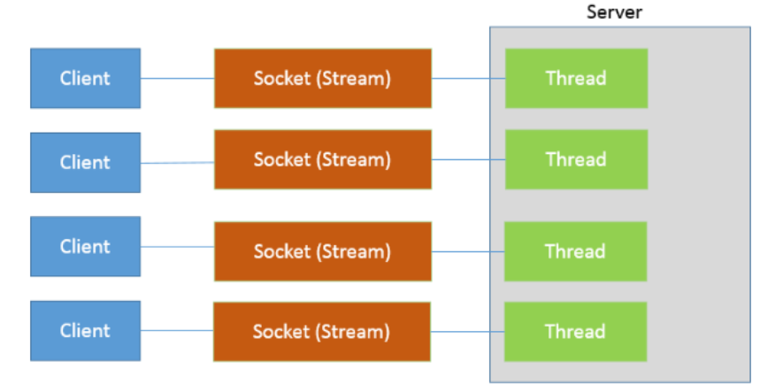
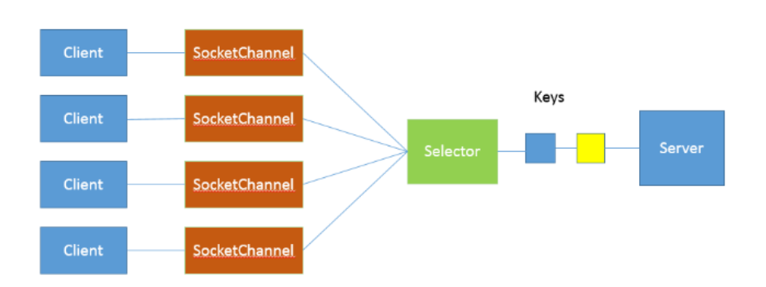

# 1.1 BIO、NIO、AIO的区别

`名词解释`

`BIO:BIO 是 BlockingIO 的缩写，顾名思义就是阻塞 IO 的意思,其实就是传统的java.io包`

`NIO 是 Java 1.4 引入的 java.nio 包，提供了 Channel、Selector、Buffer 等新的抽象，可以构建多路复用的、同步非阻塞 IO 程序，同时提供了更接近操作系统底层高性能的数据操作方式。`

`AIO 是 Java 1.7 之后引入的包，是 NIO 的升级版本，提供了异步非堵塞的 IO 操作方式，所以人们叫它 AIO（Asynchronous IO），异步 IO 是基于事件和回调机制实现的，也就是应用操作之后会直接返回，不会堵塞在那里，当后台处理完成，操作系统会通知相应的线程进行后续的操作。`

AIO 是彻底的异步通信。
 NIO 是同步非阻塞通信。
 有一个经典的举例。烧开水。
 假设有这么一个场景，有一排水壶（客户）在烧水。

 AIO的做法是，每个水壶上装一个开关，当水开了以后会提醒对应的线程去处理。
 NIO的做法是，叫一个线程不停的循环观察每一个水壶，根据每个水壶当前的状态去处理。
 BIO的做法是，叫一个线程停留在一个水壶那，直到这个水壶烧开，才去处理下一个水壶。

 可以看出AIO是最聪明省力，NIO相对省力，叫一个人就能看所有的壶，BIO最愚蠢，劳动力低下。

### 传统的Socket实现

***服务器端***

```java
		int port = 5432; //端口号
        // Socket 服务器端（简单的发送信息）
        Thread sThread = new Thread(new Runnable() {
            @Override
            public void run() {
                try {
                    ServerSocket serverSocket = new ServerSocket(port);
                    while (true) {
                        // 等待连接
                        Socket socket = serverSocket.accept();
                        Thread sHandlerThread = new Thread(new Runnable() {
                            @Override
                            public void run() {
                                try (PrintWriter printWriter = new PrintWriter(socket.getOutputStream())) {
                                    printWriter.println("hello world good boy！");
                                    printWriter.flush();
                                } catch (IOException e) {
                                    e.printStackTrace();
                                }
                            }
                        });
                        sHandlerThread.start();
                    }
                } catch (IOException e) {
                    e.printStackTrace();
                }
            }
        });
        sThread.start();

```

***接口端***

```java
		int port = 5432; //端口号
        // Socket 客户端（接收信息并打印）
        try (Socket cSocket = new Socket(InetAddress.getLocalHost(), port)) {
            BufferedReader bufferedReader = new BufferedReader(new InputStreamReader(cSocket.getInputStream()));
            bufferedReader.lines().forEach(s -> System.out.println("客户端：" + s));
        } catch (UnknownHostException e) {
            e.printStackTrace();
        } catch (IOException e) {
            e.printStackTrace();
        }
```

- 调用 accept 方法，阻塞等待客户端连接；
- 利用 Socket 模拟了一个简单的客户端，只进行连接、读取和打印；

```
在 Java 中，线程的实现是比较重量级的，所以线程的启动或者销毁是很消耗服务器的资源的，即使使用线程池来实现，使用上述传统的 Socket 方式，当连接数极具上升也会带来性能瓶颈，原因是线程的上线文切换开销会在高并发的时候体现的很明显，并且以上操作方式还是同步阻塞式的编程，性能问题在高并发的时候就会体现的尤为明显。
```



### NIO多路复用

```
NIO 是利用了单线程轮询事件的机制，通过高效地定位就绪的 Channel，来决定做什么，仅仅 select 阶段是阻塞的，可以有效避免大量客户端连接时，频繁线程切换带来的问题，应用的扩展能力有了非常大的提高。
```

***服务器端***

```java
		int port = 5432; //端口号
        // NIO 多路复用
        ThreadPoolExecutor threadPool = new ThreadPoolExecutor(4, 4,
                60L, TimeUnit.SECONDS, new LinkedBlockingQueue<Runnable>());
        threadPool.execute(new Runnable() {
            @Override
            public void run() {
                try (Selector selector = Selector.open();
                     ServerSocketChannel serverSocketChannel = ServerSocketChannel.open()) {
                    serverSocketChannel.bind(new InetSocketAddress(InetAddress.getLocalHost(), port));
                    serverSocketChannel.configureBlocking(false);
                    serverSocketChannel.register(selector, SelectionKey.OP_ACCEPT);
                    while (true) {
                        selector.select(); // 阻塞等待就绪的Channel
                        Set<SelectionKey> selectionKeys = selector.selectedKeys();
                        Iterator<SelectionKey> iterator = selectionKeys.iterator();
                        while (iterator.hasNext()) {
                            SelectionKey key = iterator.next();
                            try (SocketChannel channel = ((ServerSocketChannel) key.channel()).accept()) {
                                channel.write(Charset.defaultCharset().encode("你好，世界"));
                            }
                            iterator.remove();
                        }
                    }
                } catch (IOException e) {
                    e.printStackTrace();
                }
            }
        });
```

***客户端***

```java
		int port = 5432; //端口号
        AtomicInteger i = new AtomicInteger();
        // Socket 客户端（接收信息并打印）
        while(true) {
            try (Socket cSocket = new Socket(InetAddress.getLocalHost(), port)) {
                BufferedReader bufferedReader = new BufferedReader(new InputStreamReader(cSocket.getInputStream()));
                bufferedReader.lines().forEach(s -> System.out.println("NIO 客户端：" + s + i.getAndIncrement()));
            } catch (IOException e) {
                e.printStackTrace();
            }
        }
```

- 首先，通过 Selector.open() 创建一个 Selector，作为类似调度员的角色；

- 然后，创建一个 ServerSocketChannel，并且向 Selector 注册，通过指定 SelectionKey.OP_ACCEPT，告诉调度员，它关注的是新的连接请求；

- 为什么我们要明确配置非阻塞模式呢？这是因为阻塞模式下，注册操作是不允许的，会抛出 IllegalBlockingModeException 异常；

- Selector 阻塞在 select 操作，当有 Channel 发生接入请求，就会被唤醒；



### AIO版Socket实现

***服务器端***

```java
		int port = 5432; //端口号
        // AIO线程复用版
        Thread sThread = new Thread(new Runnable() {
            @Override
            public void run() {
                AsynchronousChannelGroup group = null;
                try {
                    group = AsynchronousChannelGroup.withThreadPool(Executors.newFixedThreadPool(4));
                    AsynchronousServerSocketChannel server = AsynchronousServerSocketChannel.open(group).bind(new InetSocketAddress(InetAddress.getLocalHost(), port));
                    server.accept(null, new CompletionHandler<AsynchronousSocketChannel, AsynchronousServerSocketChannel>() {
                        @Override
                        public void completed(AsynchronousSocketChannel result, AsynchronousServerSocketChannel attachment) {
                            server.accept(null, this); // 接收下一个请求
                            try {
                                Future<Integer> f = result.write(Charset.defaultCharset().encode("你好，世界"));
                                f.get();
                                System.out.println("服务端发送时间：" + new SimpleDateFormat("yyyy-MM-dd HH:mm:ss").format(new Date()));
                                result.close();
                            } catch (InterruptedException | ExecutionException | IOException e) {
                                e.printStackTrace();
                            }
                        }

                        @Override
                        public void failed(Throwable exc, AsynchronousServerSocketChannel attachment) {
                        }
                    });
                    group.awaitTermination(Long.MAX_VALUE, TimeUnit.SECONDS);
                } catch (IOException | InterruptedException e) {
                    e.printStackTrace();
                }
            }
        });
        sThread.start();
```

***客户端***

```java
		int port = 5432; //端口号
        // Socket 客户端
        AsynchronousSocketChannel client = AsynchronousSocketChannel.open();
        Future<Void> future = client.connect(new InetSocketAddress(InetAddress.getLocalHost(), port));
        future.get();
        ByteBuffer buffer = ByteBuffer.allocate(100);
        client.read(buffer, null, new CompletionHandler<Integer, Void>() {
            @Override
            public void completed(Integer result, Void attachment) {
                System.out.println("客户端打印：" + new String(buffer.array()));
            }

            @Override
            public void failed(Throwable exc, Void attachment) {
                exc.printStackTrace();
                try {
                    client.close();
                } catch (IOException e) {
                    e.printStackTrace();
                }
            }
        });
        Thread.sleep(10 * 1000);
```

