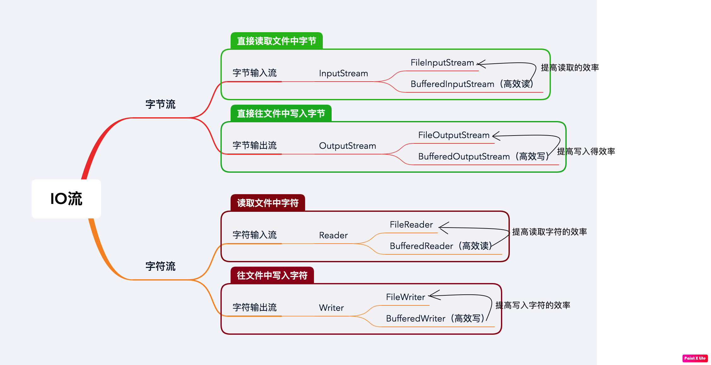
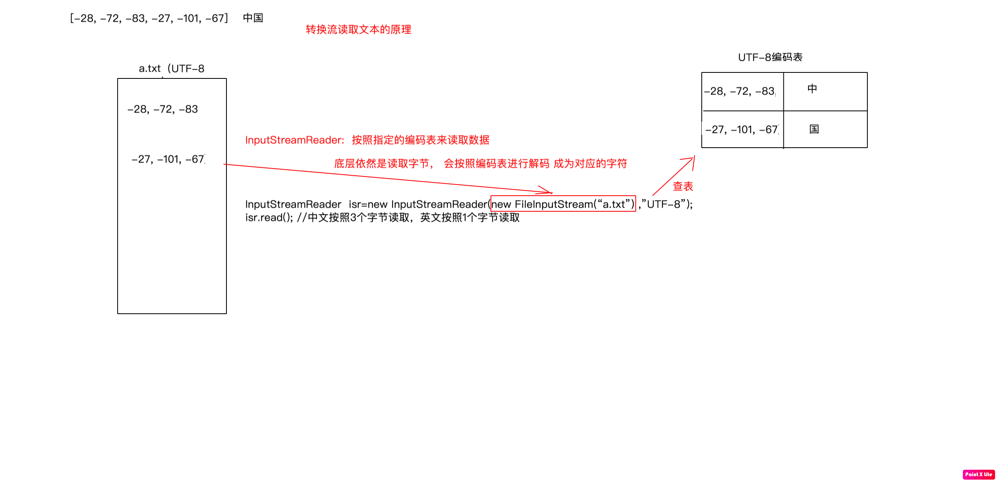
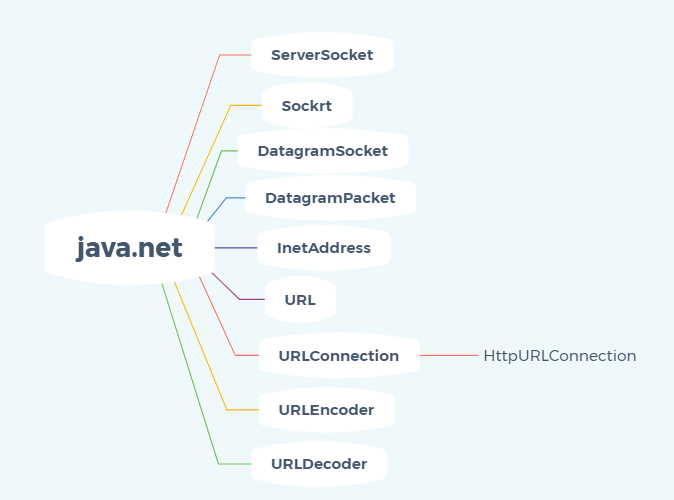

# IO流体系介绍

java对数据的操作是通过流的方式，IO流用来处理设备之间的数据传输、上传文件和下载文件，java用来操作流的对象都在IO包中。

传统的 IO 大致可以分为4种类型：

- InputStream、OutputStream 基于字节操作的 IO
- Writer、Reader 基于字符操作的 IO
- File 基于磁盘操作的 IO
- Socket 基于网络操作的 IO

先介绍前两种，即基于字节的和基于字符的IO

下图是这两种常见的IO流



其中，InputStreamReader和OutputStreamWriter分别是实现Reader接口和Writer接口的转换流，是字节流通向字符流的桥梁，转换流读取字符的原理如下图：



为了达到最高效率，可要考虑在 BufferedReader 内包装 InputStreamReader。例如： 

```java
 BufferedReader in
   = new BufferedReader(new InputStreamReader(System.in));
```

同理BufferedWriter。

# java的序列化

**序列化**就是一种处理对象流的机制，所谓对象流就是将对象的内容进行流化。可以对流化后的对象进行读写操作，也可将流化后的对象传输于网络之间。序列化是为了解决在对对象流进行读写操作时所引发的问题。

**序列化的实现**：将需要被序列化的类实现Serializable接口，该接口没有需要实现的方法，implements Serializable只是为了标注该对象是可被序列化的，然后使用一个输出流(如：FileOutputStream)来构造一个ObjectOutputStream(对象流)对象，接着，使用ObjectOutputStream对象的writeObject(Object obj)方法就可以将参数为obj的对象写出(即保存其状态)，要恢复的话则用输入流。例如，要写入可通过 ObjectInputStream 中的示例读取的对象，请执行以下操作： 

```java
        FileOutputStream fos = new FileOutputStream("t.tmp");
        ObjectOutputStream oos = new ObjectOutputStream(fos);

        oos.writeInt(12345);
        oos.writeObject("Today");
        oos.writeObject(new Date());

        oos.close();
```

我们有时候将一个java对象变成字节流的形式传出去或者从一个字节流中恢复成一个java对象，例如，要将java对象存储到硬盘或者传送给网络上的其他计算机，这个过程我们可以自己写代码去把一个java对象变成某个格式的字节流再传输，但是，jre本身就提供了这种支持，我们可以调用OutputStream的writeObject方法来做，如果要让java 帮我们做，要被传输的对象必须实现serializable接口，这样，javac编译时就会进行特殊处理，编译的类才可以被writeObject方法操作，这就是所谓的序列化。需要被序列化的类必须实现Serializable接口，该接口是一个mini接口，其中没有需要实现的方法，**implements Serializable只是为了标注该对象是可被序列化的。**

例如，在web开发中，如果对象被保存在了Session中，tomcat在重启时要把Session对象序列化到硬盘，这个对象就必须实现Serializable接口。如果对象要经过分布式系统进行网络传输或通过rmi等远程调用，这就需要在网络上传输对象，被传输的对象就必须实现Serializable接口。

# 高性能的IO体系

传统的 java.io包，它基于流模型实现，提供了我们最熟知的一些 IO 功能，比如 File 抽象、输入输出流等。交互方式是同步、阻塞的方式，也就是说，在读取输入流或者写入输出流时，在读、写动作完成之前，线程会一直阻塞在那里，它们之间的调用是可靠的线性顺序。

java.io包的好处是代码比较简单、直观，缺点则是IO效率和扩展性存在局限性，容易成为应用性能的瓶颈。

在 Java 1.4 中引入了 NIO 框架（java.nio 包），提供了 Channel、Selector、Buffer 等新的抽象，可以构建多路复用的、同步非阻塞 IO 程序，同时提供了更接近操作系统底层的高性能数据操作方式。

在 Java 7 中，NIO 有了进一步的改进，也就是 NIO 2，引入了异步非阻塞 IO 方式，也有很多人叫它 AIO（Asynchronous IO）。异步 IO 操作基于事件和回调机制，可以简单理解为，应用操作直接返回，而不会阻塞在那里，当后台处理完成，操作系统会通知相应线程进行后续工作。

首先得明白什么是同步，异步，阻塞，非阻塞.

1)同步和异步是针对应用程序和内核的交互而言的

2)阻塞和非阻塞是针对于进程在访问数据的时候，根据IO操作的就绪状态来采取的不同方式

总结一句简短的话，同步和异步是目的，阻塞和非阻塞是实现方式。

**一些名词：**

1)同步：指的是用户进程触发IO操作并等待或者轮询的去查看IO操作是否就绪 自己上街买衣服，自己亲自干这件事，别的事干不了。 

2) 异步：异步是指用户进程触发IO操作以后便开始做自己的事情，而当IO操作已经完成的时候会得到IO完成的通知（异步的特点就是通知） 告诉朋友自己合适衣服的尺寸，大小，颜色，让朋友委托去卖，然后自己可以去干别的事。（使用异步IO时，Java将IO读写委托给OS处理，需要将数据缓冲区地址和大小传给OS） 

3) 阻塞 所谓阻塞方式的意思是指, 当试图对该文件描述符进行读写时, 如果当时没有东西可读,或者暂时不可写, 程序就进入等待 状态, 直到有东西可读或者可写为止 去公交站充值，发现这个时候，充值员不在（可能上厕所去了），然后我们就在这里等待，一直等到充值员回来为止。（当然现实社会，可不是这样，但是在计算机里确实如此。） 

 4) 非阻塞 非阻塞状态下, 如果没有东西可读, 或者不可写, 读写函数马上返回, 而不会等待， 银行里取款办业务时，领取一张小票，领取完后我们自己可以玩玩手机，或者与别人聊聊天，当轮我们时，银行的喇叭会通知，这时候我们就可以去了。

5)同步阻塞IO（JAVA BIO）： 
 同步并阻塞，服务器实现模式为一个连接一个线程，即客户端有连接请求时服务器端就需要启动一个线程进行处理，如果这个连接不做任何事情会造成不必要的线程开销，当然可以通过线程池机制改善。 
 **同步非阻塞IO**(Java NIO) ： 同步非阻塞，服务器实现模式为一个请求一个线程，即客户端发送的连接请求都会注册到多路复用器上，多路复用器轮询到连接有I/O请求时才启动一个线程进行处理。用户进程也需要时不时的询问IO操作是否就绪，这就要求用户进程不停的去询问。 

 6)**异步阻塞IO**（Java NIO）： 
    此种方式下是指应用发起一个IO操作以后，不等待内核IO操作的完成，等内核完成IO操作以后会通知应用程序，这其实就是同步和异步最关键的区别，同步必须等待或者主动的去询问IO是否完成，那么为什么说是阻塞的呢？因为此时是通过select系统调用来完成的，而select函数本身的实现方式是阻塞的，而采用select函数有个好处就是它可以同时监听多个文件句柄（如果从UNP的角度看，select属于同步操作。因为select之后，进程还需要读写数据），从而提高系统的并发性！ 

 7)异步非阻塞IO（Java AIO(NIO.2)）: 
    在此种模式下，用户进程只需要发起一个IO操作然后立即返回，等IO操作真正的完成以后，应用程序会得到IO操作完成的通知，此时用户进程只需要对数据进行处理就好了，不需要进行实际的IO读写操作，因为真正的IO读取或者写入操作已经由内核完成了。

**使用场景：**

BIO方式适用于连接数目比较小且固定的架构，这种方式对服务器资源要求比较高，并发局限于应用中，JDK1.4以前的唯一选择，但程序直观简单易理解。

NIO方式适用于连接数目多且连接比较短（轻操作）的架构，比如聊天服务器，并发局限于应用中，编程比较复杂，JDK1.4开始支持。

AIO方式适用于连接数目多且连接比较长（重操作）的架构，比如相册服务器，充分调用OS参与并发操作，编程比较复杂，JDK7开始支持。

# 网络IO

[java.net](http://java.net) 下提供的 Scoket 很多时候人们也把它归为 同步阻塞 IO ,因为网络通讯同样是 IO 行为。

Java中操作网络编程相关的类定义在java.net包下



**Socket**

网络上的两个程序通过一个双向的通讯连接实现数据的交换，这个双向链路的一端称为一个Socket。

Socket通常用来实现客户方和服务方的连接。Socket是TCP/IP协议的一个十分流行的编程界面，

一个Socket由一个IP地址和一个端口号唯一确定。

但是，Socket所支持的协议种类也不光TCP/IP一种，因此两者之间是没有必然联系的。

**在Java环境下，Socket编程主要是指基于TCP/IP协议的网络编程。**