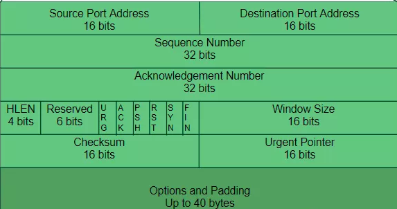

# OSI

OSI模型（Open System Interconnection Reference Model，缩写为OSI）,全名**“开放式系统互联通信参考模型”**，是一个试图使各种计算机在全世界范围内互联为网络的标准框架。1983年，国际标准组织（ISO）发布了著名的ISO/IEC 7498标准，它定义了网络互联的7层框架，也就是开放式系统互联参考模型。

网络编程7层架构

### 1.为什么需要协议？

什么是协议（protocol）？**通俗的来讲，协议是一种双方都明白或者必须遵守的事先约定**，比如说长城上放狼烟，是因为人们已经预先设定好狼烟这个物理信号代表了“敌人入侵”这一抽象信号。这样一个“狼烟=敌人入侵”就是一个简单的协议。协议可以更复杂，比如摩尔斯码(Morse Code)，使用短信号和长信号的组合，来代表不同的英文字母。
  同样，计算机之间的通信也要遵循不同层次的协议，来实现计算机的通信。早期的计算机网络，都是由各厂商自己规定一套协议，IBM，Apple，和MicroSoft都有自己的网络协议，比如MicroSoft的两台电脑用网线连起来，互相说话能听懂。但是MicroSoft和Apple的电脑连接起来说话就听不懂了，想想你和我微信聊天，我是MicroSoft电脑，你是Apple电脑，你发送的消息到我这里显示不了或者解析成另一个意思，这样通讯就不能进行了（通过上面的图我们可以看到，表示层就是**消除不同设备之间固有数据格式差异的**）。
  为了把全世界的所有不同类型的计算机都连接起来，就必须规定一套全球通用的协议，为了实现这个目标，**互联网协议簇**（Internet Protocol Suite）就成为了通用协议标准。互联网协议包含了上百种协议，但是最重要的两个协议是TCP和IP协议，而我们**通常把基于TCP和IP协议的所有协议统称为”TCP/IP协议（蔟）**”。

# Http和Https协议

### 1.前言

超文本传输协议HTTP协议被用于在Web浏览器和网站服务器之间传递信息，HTTP协议以明文方式发送内容，不提供任何方式的数据加密，如果攻击者截取了Web浏览器和网站服务器之间的传输报文，就可以直接读懂其中的信息，因此，HTTP协议不适合传输一些敏感信息，比如：信用卡号、密码等支付信息。

为了解决HTTP协议的这一缺陷，需要使用另一种协议：安全套接字层超文本传输协议HTTPS，为了数据传输的安全，HTTPS在HTTP的基础上加入了SSL协议，SSL依靠证书来验证服务器的身份，并为浏览器和服务器之间的通信加密。

### 2.基本概念

- HTTP：是互联网上应用最为广泛的一种网络协议，是一个客户端和服务器端请求和应答的标准（TCP），用于从WWW服务器传输超文本到本地浏览器的传输协议，它可以使浏览器更加高效，使网络传输减少。
- HTTPS：是以安全为目标的HTTP通道，简单讲是HTTP的安全版，即HTTP下加入SSL层，HTTPS的安全基础是SSL，因此加密的详细内容就需要SSL。HTTPS协议的主要作用可以分为两种：一种是建立一个信息安全通道，来保证数据传输的安全；另一种就是确认网站的真实性。

### 3.区别

HTTP协议传输的数据都是未加密的，也就是明文的，因此使用HTTP协议传输隐私信息非常不安全，为了保证这些隐私数据能加密传输，于是网景公司设计了SSL（Secure Sockets  Layer）协议用于对HTTP协议传输的数据进行加密，从而就诞生了HTTPS。简单来说，HTTPS协议是由SSL+HTTP协议构建的可进行加密传输、身份认证的网络协议，要比http协议安全。

　　HTTPS和HTTP的区别主要如下：

　　1、https协议需要到ca申请证书，一般免费证书较少，因而需要一定费用。

　　2、http是超文本传输协议，信息是明文传输，https则是具有安全性的ssl加密传输协议。

　　3、http和https使用的是完全不同的连接方式，用的端口也不一样，前者是80，后者是443。

　　4、http的连接很简单，是无状态的；HTTPS协议是由SSL+HTTP协议构建的可进行加密传输、身份认证的网络协议，比http协议安全。

### 4.工作原理

客户端在使用HTTPS方式与Web服务器通信时有以下几个步骤，如图所示。

　　（1）客户使用https的URL访问Web服务器，要求与Web服务器建立SSL连接。

　　（2）Web服务器收到客户端请求后，会将网站的证书信息（证书中包含公钥）传送一份给客户端。

　　（3）客户端的浏览器与Web服务器开始协商SSL连接的安全等级，也就是信息加密的等级。

　　（4）客户端的浏览器根据双方同意的安全等级，建立会话密钥，然后利用网站的公钥将会话密钥加密，并传				  送给网站。

　　（5）Web服务器利用自己的私钥解密出会话密钥。

　　（6）Web服务器利用会话密钥加密与客户端之间的通信。

### 5.优点

尽管HTTPS并非绝对安全，掌握根证书的机构、掌握加密算法的组织同样可以进行中间人形式的攻击，但HTTPS仍是现行架构下最安全的解决方案，主要有以下几个好处：

　　（1）使用HTTPS协议可认证用户和服务器，确保数据发送到正确的客户机和服务器；

　　（2）HTTPS协议是由SSL+HTTP协议构建的可进行加密传输、身份认证的网络协议，要比http协议安全，可防止数据在传输过程中不被窃取、改变，确保数据的完整性。

　　（3）HTTPS是现行架构下最安全的解决方案，虽然不是绝对安全，但它大幅增加了中间人攻击的成本。

　　（4）谷歌曾在2014年8月份调整搜索引擎算法，并称“比起同等HTTP网站，采用HTTPS加密的网站在搜索结果中的排名将会更高”。

### 6.缺点

虽然说HTTPS有很大的优势，但其相对来说，还是存在不足之处的：

　　（1）HTTPS协议握手阶段比较费时，会使页面的加载时间延长近50%，增加10%到20%的耗电；

　　（2）HTTPS连接缓存不如HTTP高效，会增加数据开销和功耗，甚至已有的安全措施也会因此而受到影响；

　　（3）SSL证书需要钱，功能越强大的证书费用越高，个人网站、小网站没有必要一般不会用。

　  （4）SSL证书通常需要绑定IP，不能在同一IP上绑定多个域名，IPv4资源不可能支撑这个消耗。

　　（5）HTTPS协议的加密范围也比较有限，在黑客攻击、拒绝服务攻击、服务器劫持等方面几乎起不到什么作用。最关键的，SSL证书的信用链体系并不安全，特别是在某些国家可以控制CA根证书的情况下，中间人攻击一样可行。

### 7.Http切换到Https

如果需要将网站从http切换到https到底该如何实现呢？

   这里需要将页面中所有的链接，例如js，css，图片等等链接都由http改为https。例如：http://www.baidu.com改为https://www.baidu.com

　　BTW，这里虽然将http切换为了https，还是建议保留http。所以我们在切换的时候可以做http和https的兼容，具体实现方式是，去掉页面链接中的http头部，这样可以自动匹配http头和https头。例如：将http://www.baidu.com改为//www.baidu.com。然后当用户从http的入口进入访问页面时，页面就是http，如果用户是从https的入口进入访问页面，页面即使https的。

# TCP/IP协议

### TCP/IP协议和UDP协议的简单介绍

从上图可以看出TCP/IP协议是属于传输层的。

1)TCP/IP协议

**IP协议**是一个分组交换协议，不保证可靠传输，一个数据包通过IP协议传输会自动分成若干小的数据包然后通过网络进行传输

**TCP（Transmission Control Protocol）协议**是一个传输控制协议，建立再IP协议之上，IP协议负责传输数据包，TCP协议负责控制传输数据包；TCP协议传输之前需要先建立连接，然后才能传输数据，传输完成后断开连接；TCP协议是一个可靠传输协议，他通过接收确认，超时重传实现；TCP协议支持双向通信，双方可以同时传输和接收数据

2)**UDP（User Datagram Protocol）协议**是数据报文协议，不面向连接，不保证可靠传输，由于UDP协议传输效率高，通常用来传输视频等能容忍丢失部分数据的文件。

TCP与UDP比较

UDP：

1.每个数据报中都给出了完整的地址信息，因此无需要建立发送方和接收方的连接。

2.UDP传输数据时是有大小限制的，每个被传输的数据报必须限定在64KB之内。

3.UDP是一个不可靠的协议，发送方所发送的数据报并不一定以相同的次序到达接收方

TCP：

1.面向连接的协议，在socket之间进行数据传输之前必然要建立连接，所以在TCP中需要连接时间。

 2.TCP传输数据大小限制，一旦连接建立起来，双方的socket就可以按统一的格式传输大的数据。

 3.TCP是一个可靠的协议，它确保接收方完全正确地获取发送方所发送的全部数据。

### TCP/IP协议之三次握手

这里只讲数据传输层的TCP协议的三次握手及相关内容。

***一.先看以下TCP报文头部报文数据结构：***

1，字段详细说明：
源端口和目的端口：各占2个字节，分别写入源端口号和目的端口号。
**序号（seq）：占4个字节。序号使用mod运算。TCP是面向字节流的，在一个TCP连接中传送的字节流中的每一个字节都按顺序编号。**
**确认序号（用小写的ack表示）：占4个字节，是期望收到对方下一个报文段的第一个数据字节的序号。若确认序号=N,则表明：到序号N-1为止的所有数据都已正确收到。**
数据偏移：占4位，表示TCP报文段的首部长度。注意，“数据偏移”的单位是32位字（即以4字节长的字为计算单位）。
保留：占6位，保留为今后使用，目前置为0。
6位标志位：URG、**ACK**、PSH、RST、**SYN**、FIN：

URG: 标识紧急指针是否有效 ；
**ACK: 标识确认序号是否有效：1表示有效，0表示无效；**
PSH: 用来提示接收端应用程序立刻将数据从tcp缓冲区读走 ；
RST: 要求重新建立连接. 我们把含有RST标识的报文称为复位报文段 ；
SYN: 请求建立连接. 我们把含有SYN标识的报文称为同步报文段 ；
**FIN: 通知对端, 本端即将关闭. 我们把含有FIN标识的报文称为结束报文段；**

窗口：占2个字节。窗口值作为接收方让发送方设置其发送窗口的依据。
检验和：占2字节。检验和字段检验的范围包括首部和数据这两部分。和UDP数据报一样，在计算检验和时，也要在TCP报文段的前面加上12字节的伪首部。伪首部的格式与UDP用户数据报的伪首部一样，但要将伪首部第四个字段中的17 改为6（协议号），把第5字段中的UDP长度改为TCP长度。
紧急指针：占2字节。紧急指针仅在URG=1时才有意义，它指出本报文段中的紧急数据的字节数。

***二，三次握手过程***

1，过程文字说明：

第一次握手：起初两端都处于CLOSED关闭状态，Client将标志位SYN置为1，随机产生一个值seq=x，并将该数据包发送给Server，Client进入SYN-SENT状态，等待Server确认；
第二次握手：Server收到数据包后由标志位SYN=1得知Client请求建立连接，Server将标志位SYN和ACK都置为1，ack=x+1，随机产生一个值seq=y，并将该数据包发送给Client以确 认连接请求，Server进入SYN-RCVD状态，**此时操作系统为该TCP连接分配TCP缓存和变量**；
第三次握手：Client收到确认后，检查ack是否为x+1，ACK是否为1，如果正确则将标志位ACK置为1，ack=y+1，并且此时操作系统为该TCP连接分配TCP缓存和变量，并将该数据包发送给Server，Server检查ack是否为y+1，ACK是否为1，如果正确则连接建立成功，Client和Server进入ESTABLISHED状态，至此双方完成三次握手，随后Client和Server就可以开始传输数据。

2，状态说明：

2.1， 三次握手的状态：
LISTEN：侦听来自远方的TCP端口的连接请求；
SYN-SENT：在发送连接请求后等待匹配的连接请求（如果有大量这样的状态包，检查是否中招了）；
SYN-RECEIVED：在收到和发送一个连接请求后等待对方对连接请求的确认（如有大量此状态，估计被flood攻击了）；
ESTABLISHED：代表一个打开的连接；

2.2， 四次挥手的状态
FIN-WAIT-1：等待远程TCP连接中断请求，或先前的连接中断请求的确认；
FIN-WAIT-2：从远程TCP等待连接中断请求；
CLOSE-WAIT：等待从本地用户发来的连接中断请求；
LAST-ACK：等待原来的发向远程TCP的连接中断请求的确认（不是什么好东西，此项出现，检查是否被攻击）；
TIME-WAIT：等待足够的时间以确保远程TCP接收到连接中断请求的确认；
CLOSED：没有任何连接状态。

**了解完上面，接下来可以从整体上看看TCP/IP数据传输的逻辑**

***三.SYN攻击***

在三次握手过程中，服务器发送SYN-ACK之后，收到客户端的ACK之前的TCP连接称为半连接(half-open connect)，此时服务器处于Syn_RECV状态，当收到ACK后，服务器转入ESTABLISHED状态。
  Syn攻击就是 攻击客户端  在短时间内伪造大量不存在的IP地址，向服务器不断地发送syn包，服务器回复确认包，并等待客户的确认，由于源地址是不存在的，服务器需要不断的重发直至超时，这些伪造的SYN包将长时间占用未连接队列，正常的SYN请求被丢弃，目标系统运行缓慢，严重者引起网络堵塞甚至系统瘫痪。
 Syn攻击是一个典型的DDOS攻击，DDOS攻击就是在多台客户端发起的分布式DOS攻击。当你在服务器上看到大量的半连接状态时，特别是源IP地址是随机的，基本上可以断定这是一次SYN攻击。

### 感谢！

以上图片来自：

https://www.cnblogs.com/entrepreneur/p/11490674.html

https://blog.csdn.net/liu_rockefeller/article/details/97641187