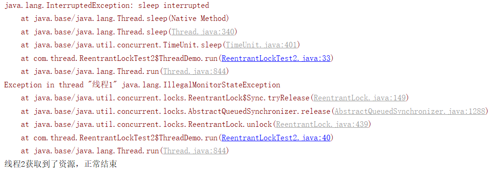

# 多线程基本知识

首先，什么是线程，线程是程序的执行路径，或者可以说是程序的控制单元。 

一个进程可能包含一个或多个进程，当一个进程存在多条执行路径时，就可以将该执行方式称为多线程。 

线程的执行方式大致可分为就绪(wait)，执行(run)，阻塞(block)三个状态，而三个状态的转换实质上是在抢夺cpu资源过程中造成的，正常情况下cpu资源不会被线程独自占用，因此多个线程在运行中相互抢夺资源，造成线程在上述的三个状态之间不断的相互转换。而这也是多线程的执行方式。

### **创建线程的三种方法（掌握前面两种）**

**1.**继承Thread类，重写父类run()方法

**2.**实现runnable接口

**3.**使用ExecutorService、Callable、Future实现有返回结果的多线程(JDK5.0以后)

### 多线程同步机制

在需要同步的方法的方法签名中加入synchronized关键字。

使用synchronized块对需要进行同步的代码段进行同步。

使用JDK 5中提供的java.util.concurrent.lock包中的Lock对象。

一段synchronized的代码被一个线程执行之前，他要先拿到执行这段代码的权限，在 java里边就是拿到某个同步对象的锁（一个对象只有一把锁）； 如果这个时候同步对象的锁被其他线程拿走了，他（这个线程）就只能等了（线程阻塞在锁池 等待队列中）。 取到锁后，他就开始执行同步代码(被synchronized修饰的代码）；线程执行完同步代码后马上就把锁还给同步对象，其他在锁池中 等待的某个线程就可以拿到锁执行同步代码了。这样就保证了同步代码在统一时刻只有一个线程在执行。

### **线程的几种可用状态（生命周期）**

线程在执行过程中，可以处于下面几种状态：

就绪(Runnable):线程准备运行，不一定立马就能开始执行。

运行中(Running)：进程正在执行线程的代码。

等待中(Waiting):线程处于阻塞的状态，等待外部的处理结束。

睡眠中(Sleeping)：线程被强制睡眠。

I/O阻塞(Blocked on I/O)：等待I/O操作完成。

同步阻塞(Blocked on Synchronization)：等待获取锁。

死亡(Dead)：线程完成了执行

### 线程锁对象详解

多线程可以同时运行多个任务

但是当多个线程同时访问共享数据时，可能导致数据不同步，甚至错误！

so,不使用线程锁, 可能导致错误

应用场景:

I/O密集型操作 需要资源保持同步  

优缺点:

优点:保证资源同步 

缺点:有等待肯定会慢

扩展(死锁与递归锁)

如果多个线程要调用多个对象，而A线程调用A锁占用了A对象，B线程调用了B锁占用了B对象,A线程不能调用B对象，B线程不能调用A对象，于是一直等待。这就造成了线程“死锁”。

```python
//python
Threading模块中，也有一个类，RLock，称之为可重入锁。该锁对象内部维护着一个Lock和一个counter对象。counter对象记录了acquire的次数，使得资源可以被多次require。最后，当所有RLock被release后，其他线程才能获取资源。在同一个线程中，RLock.acquire可以被多次调用，利用该特性，可以解决部分死锁问题。

就是把 lock=threading.Lock()改成lock = threading.RLock()
```

```java
//java中的可重入锁----ReentrantLock
ReentrantLock常常对比着synchronized来分析，我们先对比着来看然后再一点一点分析。

（1）synchronized是独占锁，加锁和解锁的过程自动进行，易于操作，但不够灵活。ReentrantLock也是独占锁，加锁和解锁的过程需要手动进行，不易操作，但非常灵活。

（2）synchronized可重入，因为加锁和解锁自动进行，不必担心最后是否释放锁；ReentrantLock也可重入，但加锁和解锁需要手动进行，且次数需一样，否则其他线程无法获得锁。

（3）synchronized不可响应中断，一个线程获取不到锁就一直等着；ReentrantLock可以响应中断。

ReentrantLock好像比synchronized关键字没好太多，我们再去看看synchronized所没有的，一个最主要的就是ReentrantLock还可以实现公平锁机制。什么叫公平锁呢？也就是在锁上等待时间最长的线程将获得锁的使用权。通俗的理解就是谁排队时间最长谁先执行获取锁。
```

### ReentrantLock

> 公平锁实现

```java
public class ReentrantLockTest1 {
    private static final Lock lock = new ReentrantLock(true);
    public static void main(String[] args) {
        new Thread(() -> test2(),"线程1").start();
        new Thread(() -> test2(),"线程2").start();
        new Thread(() -> test2(),"线程3").start();
        new Thread(() -> test2(),"线程4").start();
        new Thread(() -> test2(),"线程5").start();

    }

    public static void test2() {
        for (int i = 0; i < 2; i++) {
            try{
                lock.lock();
                System.out.println(Thread.currentThread().getName() + "获取了锁");
                TimeUnit.SECONDS.sleep(2);
            }catch (Exception e) {
                e.printStackTrace();
            }finally {
                System.out.println(Thread.currentThread().getName() + "释放了锁");
                lock.unlock();
            }
        }

    }
}
```


> 非公平锁实现

非公平锁那就随机的获取，谁运气好，cpu时间片轮到哪个线程，哪个线程就能获取锁，和上面公平锁的区别很简单，就在于先new一个ReentrantLock的时候参数为false，当然我们也可以不写，默认就是false。这里就不测了。

> 响应中断

响应中断就是一个线程获取不到锁，不会傻傻的一直等下去，ReentrantLock会给予一个中断回应。在这里我们举一个死锁的案例。看如下例子：

```java
public class ReentrantLockTest2 {
    static Lock lock1= new ReentrantLock();
    static Lock lock2 = new ReentrantLock();
    public static void main(String[] args) throws InterruptedException {
        Thread thread1 = new Thread(new ThreadDemo(lock1, lock2),"线程1");
        Thread thread2 = new Thread(new ThreadDemo(lock2, lock1),"线程2");
        thread1.start();
        thread2.start();
        thread1.interrupt();

    }

    static class ThreadDemo implements Runnable{

        Lock firstLock;
        Lock secondLock;

        public ThreadDemo(Lock firstLock,Lock secondLock) {
            this.firstLock = firstLock;
            this.secondLock = secondLock;
        }
        @Override
        public void run() {
            try{
                firstLock.lockInterruptibly();//lockInterruptibly()方法是如果当前线程未被中断，则获取锁。
//                firstLock.lock();
                TimeUnit.MILLISECONDS.sleep(50);
                secondLock.lockInterruptibly();
//                secondLock.lock();
            }catch (Exception e) {
                e.printStackTrace();
            }finally {
                firstLock.unlock();
                secondLock.unlock();
                System.out.println(Thread.currentThread().getName() + "获取到了资源，正常结束");
            }
        }
    }
}
```


`把两个lock后面的方法换一换就变成下面这样了`




```java
这里出现了InterrupedtException，我们需要知道InterruptedException是什么。

根据Java Doc的定义

Thrown when a thread is waiting, sleeping, or otherwise occupied, and the thread is interrupted, either before or during the activity. Occasionally a method may wish to test whether the current thread has been interrupted, and if so, to immediately throw this exception.
意思是说当一个线程处于等待，睡眠，或者占用，也就是说阻塞状态，而这时线程被中断就会抛出这类错误。Java6之后结束某个线程A的方法是A.interrupt()。如果这个线程正处于非阻塞状态，比如说线程正在执行某些代码的时候，如果被interrupt，那么该线程的interrupt变量会被置为true，告诉别人说这个线程被中断了（只是一个标志位，这个变量本身并不影响线程的中断与否），但是线程不会被中断，这时不会有interruptedException。但如果这时线程被阻塞了，比如说正在睡眠，则其中断状态将被清除，还将会抛出这个错误。请注意，这个时候变量interrupt没有被置为true,而且也没有人来中断这个线程。

```

`直接看代码`

```java
while(true){
    try {
     Thread.sleep(1000);
    }catch(InterruptedException ex)
    {
          logger.error("thread interrupted",ex);
    } 
}
```

`当线程执行sleep(1000)之后会被立即阻塞，如果在阻塞时外面调用interrupt来中断这个线程，那么就会执行`

```java
logger.error("thread interrupted",ex);
```

这个时候其实线程并未中断，因为当在sleep中的线程被调用interrupt方法时，就会放弃暂停的状态，并抛出InterruptException异常，这样一来，线程的控制权就交给了捕获这个异常的catch块了。执行完这条语句之后线程会继续执行while循环，开始sleep，所以说如果没有对InterruptedException进行处理，后果就是线程可能无法中断。

```java
Interrupt方法的作用-------

interrupt方法只是改变了中断状态

sleep方法内部会不断的检查中断状态的值，从而自己抛出InterruptedException.

由 Thread 提供并受 Thread.sleep() 和 Object.wait() 支持的中断机制就是一种取消机制；它允许一个线程请求另一个线程停止它正在做的事情。当一个方法抛出 InterruptedException 时，它是在告诉您，如果执行该方法的线程被中断，它将尝试停止它正在做的事情而提前返回，并通过抛出 InterruptedException 表明它提前返回。 行为良好的阻塞库方法应该能对中断作出响应并抛出 InterruptedException，以便能够用于可取消活动中，而不至于影响响应。
```

所以，在任何时候碰到InterruptedException，都要手动把自己这个线程中断。由于这个时候已经处于非阻塞状态，所以可以正常中断，最正确的代码如下：

```java
while(!Thread.isInterrupted()){
    try {
     Thread.sleep(1000);
    }catch(InterruptedException ex)
    {
          Thread.interrupt()
    } 
}
//这样可以保证线程一定能够被及时中断。
```

```java
lock 与 lockInterruptibly比较区别在于：
lock 优先考虑获取锁，待获取锁成功后，才响应中断。
lockInterruptibly 优先考虑响应中断，而不是响应锁的普通获取或重入获取。

详细区别：

ReentrantLock.lockInterruptibly允许在等待时由其它线程调用等待线程的Thread.interrupt方法来中断等待线程的等待而直接返回，这时不用获取锁，而会抛出一个InterruptedException。 ReentrantLock.lock方法不允许Thread.interrupt中断,即使检测到Thread.isInterrupted,一样会继续尝试获取锁，失败则继续休眠。只是在最后获取锁成功后再把当前线程置为interrupted状态,然后再中断线程。

lockInterruptibly()方法比较特殊，当通过这个方法去获取锁时，如果线程正在等待获取锁，则这个线程能够响应中断，即中断线程的等待状态。也就使说，当两个线程同时通过lock.lockInterruptibly()想获取某个锁时，假若此时线程A获取到了锁，而线程B只有在等待，那么对线程B调用threadB.interrupt()方法能够中断线程B的等待过程。
由于lockInterruptibly()的声明中抛出了异常，所以lock.lockInterruptibly()必须放在try块中或者在调用lockInterruptibly()的方法外声明抛出InterruptedException。
注意，当一个线程获取了锁之后，是不会被interrupt()方法中断的。因为本身在前面的文章中讲过单独调用interrupt()方法不能中断正在运行过程中的线程，只能中断阻塞过程中的线程。
因此当通过lockInterruptibly()方法获取某个锁时，如果不能获取到，只有进行等待的情况下，是可以响应中断的。


/*
	-lock()
	最上面代码执行之后
	1.线程1的获得了firstLock的锁，线程2获得了secondLock的锁，然后两个线程都在sleep状态，这时线程1被		interrupt，又因为这时线程1在sleep，所以报java.lang.InterruptedException: sleep 			  interrupted的错，然后直接执行finally里面的代码，又因为ReentrantLock.lock方法不允许			  Thread.interrupt中断,即使检测到Thread.isInterrupted,一样会继续尝试获取锁，所以这时锁1还在手		  上，于是就释放了firstLock的锁，并且还想释放secondLock的锁，但是这个锁不在自己手上，所有报了 		  java.lang.IllegalMonitorStateException。线程2里的这时从sleep中出来了想要firstLock的锁，刚	   好firstLock的锁也被释放了，所以就一路通畅，看下面代码应该阔以很明白
*/
    
public void run() {
            try{
                firstLock.lock();
                TimeUnit.MILLISECONDS.sleep(50);
                System.out.println("在try里" + Thread.currentThread().getName() + "--" + new Date().getTime());
                secondLock.lock();
            }catch (Exception e) {
                e.printStackTrace();
            }finally {
                firstLock.unlock();
                System.out.println(Thread.currentThread().getName() + "--" + new Date().getTime());
                secondLock.unlock();
                System.out.println(Thread.currentThread().getName() + "获取到了资源，正常结束");
            }
        }
```


```java
/*
	-lockInterruptibly()
	最上面代码执行之后
	1.线程1的获得了firstLock的锁，进入到sleep状态，然后线程2获得了secondLock的锁，进入到sleep状态，然后这时线程1想获取secondLock的锁，但不在自己手上，只有进行等待，这时又被interrupt，所以直接抛出InterruptedException，并且线程中断，firstLock也被释放了，这时再去调用firstLock的unlock方法，就抛出了java.lang.IllegalMonitorStateException，而这时候线程2有锁2，锁1又不在线程1中，一路畅通无阻。
*/

@Override
public void run() {
            try{
                firstLock.lockInterruptibly();//lockInterruptibly()方法是如果当前线程未被中断，则获取锁。
                TimeUnit.MILLISECONDS.sleep(50);
                System.out.println("在try里" + Thread.currentThread().getName() + "--" + new Date().getTime());
                secondLock.lockInterruptibly();
            }catch (Exception e) {
                e.printStackTrace();
            }finally {
                firstLock.unlock();
                System.out.println(Thread.currentThread().getName() + "--" + new Date().getTime());
                secondLock.unlock();
                System.out.println(Thread.currentThread().getName() + "获取到了资源，正常结束");
            }
        }
```


# 面试常见问题

### 同步方法的实现方式

1)同步方法 

  用synchronized关键字修饰的方法。 

```java
由于java的每个对象都有一个内置锁，当用此关键字修饰方法时，内置锁会保护整个方法。在调用该方法前，需要获得内置锁，否则就处于阻塞状态。代码如： 

public synchronized void save(){}

注： synchronized关键字也可以修饰静态方法，此时如果调用该静态方法，将会锁住整个类
```

2)同步代码块 

 ```
即用synchronized关键字修饰的语句块。 
    被该关键字修饰的语句块会自动被加上内置锁，从而实现同步,代码如： 
    synchronized(object){ 
    }
    注：同步是一种高开销的操作，因此应该尽量减少同步的内容。 
    通常没有必要同步整个方法，使用synchronized代码块同步关键代码即可。 

 ```

3)使用特殊域变量(volatile)实现线程同步

```java
  a.volatile关键字为域变量的访问提供了一种免锁机制， 

  b.使用volatile修饰域相当于告诉虚拟机该域可能会被其他线程更新， 

  c.因此每次使用该域就要重新计算，而不是使用寄存器中的值 

  d.volatile不会提供任何原子操作，它也不能用来修饰final类型的变量 

 注：多线程中的非同步问题主要出现在对域的读写上，如果让域自身避免这个问题，则就不需要修改操作该域的方法。 

    用final域，有锁保护的域和volatile域可以避免非同步的问题。
```

4)使用重入锁实现线程同步

```java
在JavaSE5.0中新增了一个java.util.concurrent包来支持同步。 

  ReentrantLock类是可重入、互斥、实现了Lock接口的锁， 

  它与使用synchronized 方法 和 块 具有相同的基本行为和语义，并且扩展了其能力

  ReenreantLock类的常用方法有：

​    ReentrantLock() : 创建一个ReentrantLock实例 

​    lock() : 获得锁 

​    unlock() : 释放锁 

  注：ReentrantLock()还有一个可以创建公平锁的构造方法，但由于能大幅度降低程序运行效率，不推荐使用 

 注：关于Lock对象和synchronized关键字的选择： 

​    a.最好两个都不用，使用一种java.util.concurrent包提供的机制， 

​      能够帮助用户处理所有与锁相关的代码。 

​    b.如果synchronized关键字能满足用户的需求，就用synchronized，因为它能简化代码 

​    c.如果需要更高级的功能，就用ReentrantLock类，此时要注意及时释放锁，否则会出现死锁，通常在finally代码释放锁 

```

5)使用局部变量实现线程同步 

```java
如果使用ThreadLocal管理变量，则每一个使用该变量的线程都获得该变量的副本， 

  副本之间相互独立，这样每一个线程都可以随意修改自己的变量副本，而不会对其他线程产生影响。

  ThreadLocal 类的常用方法

  ThreadLocal() : 创建一个线程本地变量 

  get() : 返回此线程局部变量的当前线程副本中的值 

  initialValue() : 返回此线程局部变量的当前线程的"初始值" 

  set(T value) : 将此线程局部变量的当前线程副本中的值设置为value

注：ThreadLocal与同步机制 

​    a.ThreadLocal与同步机制都是为了解决多线程中相同变量的访问冲突问题。 

​    b.前者采用以"空间换时间"的方法，后者采用以"时间换空间"的方式 
```

6)使用阻塞队列实现线程同步

```java
 前面5种同步方式都是在底层实现的线程同步，但是我们在实际开发当中，应当尽量远离底层结构。 

  使用javaSE5.0版本中新增的java.util.concurrent包将有助于简化开发。 

  本小节主要是使用LinkedBlockingQueue<E>来实现线程的同步 

  LinkedBlockingQueue<E>是一个基于已连接节点的，范围任意的blocking queue。 

  队列是先进先出的顺序（FIFO） 

  LinkedBlockingQueue 类常用方法 

  LinkedBlockingQueue() : 创建一个容量为Integer.MAX_VALUE的LinkedBlockingQueue 

  put(E e) : 在队尾添加一个元素，如果队列满则阻塞 

  size() : 返回队列中的元素个数 

  take() : 移除并返回队头元素，如果队列空则阻塞 
```

7)使用原子变量实现线程同步

```java
需要使用线程同步的根本原因在于对普通变量的操作不是原子的。

那么什么是原子操作呢？

原子操作就是指将读取变量值、修改变量值、保存变量值看成一个整体来操作

即-这几种行为要么同时完成，要么都不完成。

在java的util.concurrent.atomic包中提供了创建了原子类型变量的工具类，

使用该类可以简化线程同步。

其中AtomicInteger 表可以用原子方式更新int的值，可用在应用程序中(如以原子方式增加的计数器)，

但不能用于替换Integer；可扩展Number，允许那些处理机遇数字类的工具和实用工具进行统一访问。

AtomicInteger类常用方法：

AtomicInteger(int initialValue) : 创建具有给定初始值的新的AtomicInteger

addAddGet(int dalta) : 以原子方式将给定值与当前值相加

get() : 获取当前值
```

### 什么是死锁？如何避免死锁

两个进程都在等待对方执行完毕才能继续往下执行的时候就发生了死锁。结果就是两个进程都陷入了无限的等待中。

使用多线程的时候，一种非常简单的避免死锁的方式就是：指定获取锁的顺序，并强制线程按照指定的顺序获取锁。因此，如果所有的线程都是以同样的顺序加锁和释放锁，就不会出现死锁了。

***在上面ReentrantLock中就涉及到死锁***

### sleep方法和wait方法的区别

```java
来自不同的类： wait()方法是Object类的方法，sleep方法是Thread类的方法。

对于锁的占用情况不同：最主要是sleep方法没有释放锁，而 wait 方法释放了锁，使得其他线程可以使用同步控制块或者方法。

使用范围： wait，notify和notifyAll只能在同步控制方法或者同步控制块里面使用，而sleep可以在任何地方使用） 　

 唤醒方式：调用sleep()方法的线程通常是睡眠一定时间后，自动醒来。对象调用wait()方法，必须采用notify()或者notifyAll()方法唤醒。
```

```java
Sleep()方法

Sleep()方法属于Thread类中方法，表示让一个线程进入睡眠状态，等待一定的时间之后，自动醒来进入到可运行状态，不会马上进入运行状态，因为线程调度机制恢复线程的运行也需要时间，一个线程对象调用了sleep方法之后，并不会释放他所持有的所有对象锁，所以也就不会影响其他进程对象的运行。但在sleep的过程中有可能被其他对象调用它的interrupt(),产生InterruptedException异常，如果你的程序不捕获这个异常，线程就会异常终止，进入TERMINATED状态，如果你的程序捕获了这个异常，那么程序就会继续执行catch语句块（可能还有finally语句块）以及以后的代码。

注意sleep()方法是一个静态方法，也就是说他只对当前对象有效，通过t.sleep()让t对象进入sleep，这样的做法是错误的，它只会是使当前线程被sleep 而不是t线程。 
```

```java
Wait()方法
    
Wait()属于Object的成员方法，一旦一个对象调用了wait方法，必须要采用notify()和notifyAll()方法唤醒该进程；如果线程拥有某个或某些对象的同步锁，那么在调用了wait()后，这个线程就会释放它持有的所有同步资源，而不限于这个被调用了wait()方法的对象。wait()方法也同样会在wait的过程中有可能被其他对象调用interrupt()方法而产生InterruptedException，效果以及处理方式同sleep()方法。
```


### 线程局部变量ThreadLocal

ThreadLocal 的作用和目的：用于实现线程内的数据共享，即对于相同的程序代码，多个模块在同一个

线程中运行时要共享一份数据，而在另外线程中运行时又共享另外一份数据。 

每个线程调用全局 ThreadLocal 对象的 set 方法，在 set 方法中，首先根据当前线程获取当前线程的

ThreadLocalMap 对象，然后往这个 map 中插入一条记录，key 其实是 ThreadLocal 对象，value 是各自的 set

方法传进去的值。也就是每个线程其实都有一份自己独享的ThreadLocalMap对象，该对象的Key是ThreadLocal

对象，值是用户设置的具体值。在线程结束时可以调用 ThreadLocal.remove()方法，这样会更快释放内存，不调

用也可以，因为线程结束后也可以自动释放相关的 ThreadLocal 变量。

`ThreadLocal 的应用场景：` 

➢  订单处理包含一系列操作：减少库存量、增加一条流水台账、修改总账，这几个操作要在同一个

事务中完成，通常也即同一个线程中进行处理，如果累加公司应收款的操作失败了，则应该把前面

的操作回滚，否则，提交所有操作，这要求这些操作使用相同的数据库连接对象，而这些操作的代码

分别位于不同的模块类中。 

➢  银行转账包含一系列操作： 把转出帐户的余额减少，把转入帐户的余额增加，这两个操作要在

同一个事务中完成，它们必须使用相同的数据库连接对象，转入和转出操作的代码分别是两个不同

的帐户对象的方法。 

➢  例如 Strut2 的 ActionContext，同一段代码被不同的线程调用运行时，该代码操作的数据是每

个线程各自的状态和数据，对于不同的线程来说，getContext 方法拿到的对象都不相同，对同一个

线程来说，不管调用 getContext 方法多少次和在哪个模块中 getContext 方法，拿到的都是同一

个。

### 什么是守护线程

守护线程（即daemon thread），是个服务线程，准确地来说就是服务其他的线程，这是它的作用——而其他的线程只有一种，那就是用户线程。所以java里线程分2种，

1、守护线程，比如垃圾回收线程，就是最典型的守护线程。

2、用户线程，就是应用程序里的自定义线程。

 

1、守护线程，专门用于服务其他的线程，如果其他的线程（即用户自定义线程）都执行完毕，连main线程也执行完毕，那么jvm就会退出（即停止运行）——此时，连jvm都停止运行了，守护线程当然也就停止执行了。

2、再换一种说法，如果有用户自定义线程存在的话，jvm就不会退出——此时，守护线程也不能退出，也就是它还要运行，干嘛呢，就是为了执行垃圾回收的任务啊。

 

用户自定义线程

1、应用程序里的线程，一般都是用户自定义线程。

2、用户也可以在应用程序代码自定义守护线程，只需要调用Thread类的设置方法设置一下即可。

### 同步和异步的区别

***同步（Sync）***

```java
所谓同步，就是发出一个功能调用时，在没有得到结果之前，该调用就不返回或继续执行后续操作。 

根据这个定义，Java中所有方法都是同步调用，应为必须要等到结果后才会继续执行。我们在说同步、异步的时候，一般而言是特指那些需要其他端协作或者需要一定时间完成的任务。 

简单来说，同步就是必须一件一件事做，等前一件做完了才能做下一件事。
```

***异步（Async）***

```java
异步与同步相对，当一个异步过程调用发出后，调用者在没有得到结果之前，就可以继续执行后续操作。当这个调用完成后，一般通过状态、通知和回调来通知调用者。对于异步调用，调用的返回并不受调用者控制。 

举个例子简单说明下两者的区别： 

同步：火车站多个窗口卖火车票，假设A窗口当卖第288张时，在这个短暂的过程中，其他窗口都不能卖这张票，也不能继续往下卖，必须这张票处理完其他窗口才能继续卖票。直白点说就是当你看见程序里出现synchronized这个关键字，将任务锁起来，当某个线程进来时，不能让其他线程继续进来，那就代表是同步了。

异步：当我们用手机下载某个视频时，我们大多数人都不会一直等着这个视频下载完，而是在下载的过程看看手机里的其他东西，比如用qq或者是微信聊聊天，这种的就是异步，你执行你的，我执行我的，互不干扰。比如上面卖火车票，如果多个窗口之间互不影响，我行我素，A窗口卖到第288张了，B窗口不管A窗口，自己也卖第288张票，那显然会出错了
```

### synchronized和volatile的区别

a）volatile不需要加锁，比synchronized更轻便，不会阻塞线程

b）synchronized既能保证可见性，又能保证原子性，而volatile只能保证可见性，无法保证原子性

   与锁相比，Volatile 变量是一种非常简单但同时又非常脆弱的同步机制，它在某些情况下将提供优于锁的性能和伸缩性。如果严格遵循 volatile 的使用条件（**变量真正独立于其他变量和自己以前的值** ） 在某些情况下可以使用 volatile 代替 synchronized 来优化代码提升效率。

### 乐观锁和悲观锁的理解以及如何实现

悲观锁：总是假设最坏的情况，每次去拿数据的时候都认为别人会修改，所以每次在拿数据的时候都会上锁，这样别人想拿这个数据就会阻塞直到它拿到锁。传统的关系型数据库里边就用到了很多这种锁机制，比如行锁，表锁等，读锁，写锁等，都是在做操作之前先上锁。再比如Java里面的同步原语synchronized关键字的实现也是悲观锁。

乐观锁：顾名思义，就是很乐观，每次去拿数据的时候都认为别人不会修改，所以不会上锁，但是在更新的时候会判断一下在此期间别人有没有去更新这个数据，可以使用版本号等机制。乐观锁适用于多读的应用类型，这样可以提高吞吐量，像数据库提供的类似于write_condition机制，其实都是提供的乐观锁。在Java中java.util.concurrent.atomic包下面的原子变量类就是使用了乐观锁的一种实现方式CAS实现的。

### 顺序执行T1、T2、T3、三个线程

`一种是运用sleep方法，sleep的时间一次增长就可以了，很容易想到但效率不高`

`第二种运用join方法`

```java
首先了解多线程里的join方法
Join方法：
例如：在A线程中，调用B的join方法
作用：A等待B线程执行完毕后（释放CPU执行权），在继续执行。
    
思路：在T2中用T1的join方法，在T3中用T2的join方法，记得try-catch
 
代码：
public class Test007 {
    public static void main(String[] args) {
        Thread t1 = new Thread(new Runnable() {
            @Override
            public void run() {
                for (int i = 0; i < 2; i++) {
                    System.out.println("T1,i"+i);
                }
            }
        });
        t1.start();
        Thread t2 = new Thread(new Runnable() {
            @Override
            public void run() {
                try {
                    t1.join();
                } catch (InterruptedException e) {
                    e.printStackTrace();
                }
                for (int i = 0; i < 2; i++) {
                    System.out.println("T2,i"+i);
                }
            }
        });

        t2.start();
        Thread t3 = new Thread(new Runnable() {
            @Override
            public void run() {
                try {
                    t2.join();
                } catch (InterruptedException e) {
                    e.printStackTrace();
                }
                for (int i = 0; i < 2; i++) {
                    System.out.println("T3,i"+i);
                }
            }
        });
        t3.start();
    }
}
```

### 线程池（Executors）

***首次我们来说下线程池的作用:*** 

 线程池作用就是限制系统中执行线程的数量。 

根据系统的环境情况，可以自动或手动设置线程数量，达到运行的最佳效果；少了浪费了系统资源，多了造成系                 统拥挤效率不高。用线程池控制线程数量，其他线程 排队等候。一个任务执行完毕，再从队列的中取最前面的任务开始执行。若队列中没有等待进程，线程池的这一资源处于等待。当一个新任务需要运行时，如果线程 池中有等待的工作线程，就可以开始运行了；否则进入等待队列。

 

***为什么要用线程池:*** 

  减少了创建和销毁线程的次数，每个工作线程都可以被重复利用，可执行多个任务

  可以根据系统的承受能力，调整线程池中工作线线程的数目，防止因为因为消耗过多的内存，而把服务

器累趴下(每个线程需要大约 1MB 内存，线程开的越多，消耗的内存也就越大，最后死机) 

 

***Executors 详解:*** 

Java 里面线程池的顶级***接口***是 Executor，但是严格意义上讲 Executor 并不是一个线程池，而只是一个

执行线程的工具。真正的线程池接口是 ExecutorService。**ThreadPoolExecutor** 是 Executors ***类***的底层实

现。我们先介绍下 Executors。 

线程池的基本思想还是一种对象池的思想，开辟一块内存空间，里面存放了众多(未死亡)的线程，池中线程执行调度由池管理器来处理。当有线程任务时，从池中取一个，执行完成后线程对象归池，这样可以避免反

复创建线程对象所带来的性能开销，节省了系统的资源。

ThreadPoolExecutor构造方法

Executors中创建线程池的快捷方法，实际上是调用了**ThreadPoolExecutor**的构造方法（定时任务使用的是ScheduledThreadPoolExecutor），该类构造方法参数列表如下：

// Java线程池的完整构造函数

```java
public ThreadPoolExecutor(

int corePoolSize, // 线程池长期维持的线程数，即使线程处于Idle状态，也不会回收。 

int maximumPoolSize, // 线程数的上限 

long keepAliveTime,TimeUnit unit,//超过corePoolSize的线程的idle时长,超过这个时间，多余的线程会被回收。

BlockingQueue<Runnable> workQueue, //任务的排队队列

 ThreadFactory threadFactory,//新线程的产生方式

 RejectedExecutionHandler handler) // 拒绝策略 

 
```

竟然有7个参数，很无奈，构造一个线程池确实需要这么多参数。这些参数中，比较容易引起问题的有corePoolSize, maximumPoolSize, workQueue以及handler：

corePoolSize和maximumPoolSize设置不当会影响效率，甚至耗尽线程；

workQueue设置不当容易导致OOM；

handler设置不当会导致提交任务时抛出异常。

 

***Java通过Executors提供四种线程池，分别为：***

```java
newCachedThreadPool创建一个可缓存线程池，如果线程池长度超过处理需要，可灵活回收空闲线程，若无可回收，则新建线程。

newFixedThreadPool 创建一个定长线程池，可控制线程最大并发数，超出的线程会在队列中等待。

newScheduledThreadPool 创建一个定长线程池，支持定时及周期性任务执行。

newSingleThreadExecutor 创建一个单线程化的线程池，它只会用唯一的工作线程来执行任务，保证所有任务按照指定顺序（FIFO， LIFO， 优先级）执行。
```