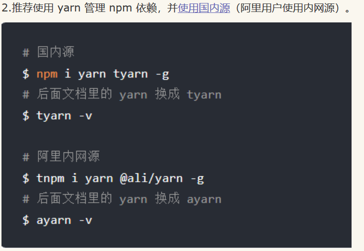

# 在Linux下可以如下命令检测是否被Syn攻击

命令1：
  netstat -n | awk '/^tcp/ {++S[$NF]} END {for(a in S) print a, S[a]}'
命令2：
  netstat -n|grep  ^tcp|awk '{print $NF}'|sort -nr|uniq -c
命令3：
  netstat -n | awk '/^tcp/ {++state[$NF]} END {for(key in state) print key,"t",state[key]}'
返回结果一般如下：
  LAST_ACK 5 （正在等待处理的请求数）
  SYN_RECV 30
  ESTABLISHED 1597 （正常数据传输状态）
  FIN_WAIT1 51
  FIN_WAIT2 504
  TIME_WAIT 1057 （处理完毕，等待超时结束的请求数）

# Linux上TCP三次握手包的抓取

linux提供了非常强大的tcpdump命令用于抓取：
4.1，tcpdump参数：
-A 以ASCII格式打印出所有分组，并将链路层的头最小化。 
-c 在收到指定的数量的分组后，tcpdump就会停止。 
-C 在将一个原始分组写入文件之前，检查文件当前的大小是否超过了参数file_size  中指定的大小。如果超过了指定大小，则关闭当前文件，然后在打开一个新的文件。参数 file_size  的单位是兆字节（是1,000,000字节，而不是1,048,576字节）。 
-d 将匹配信息包的代码以人们能够理解的汇编格式给出。 
-dd 将匹配信息包的代码以C语言程序段的格式给出。 
-ddd 将匹配信息包的代码以十进制的形式给出。 
-D 打印出系统中所有可以用tcpdump截包的网络接口。 
-e 在输出行打印出数据链路层的头部信息。 
-E 用spi@ipaddr algo:secret解密那些以addr作为地址，并且包含了安全参数索引值spi的IPsec ESP分组。 
-f 将外部的Internet地址以数字的形式打印出来。 
-F 从指定的文件中读取表达式，忽略命令行中给出的表达式。 
-i 指定监听的网络接口。 
-l 使标准输出变为缓冲行形式，可以把数据导出到文件。 
-L 列出网络接口的已知数据链路。 
-m 从文件module中导入SMI MIB模块定义。该参数可以被使用多次，以导入多个MIB模块。 
-M 如果tcp报文中存在TCP-MD5选项，则需要用secret作为共享的验证码用于验证TCP-MD5选选项摘要（详情可参考RFC 2385）。 
-b 在数据-链路层上选择协议，包括ip、arp、rarp、ipx都是这一层的。 
-n 不把网络地址转换成名字。 
-nn 不进行端口名称的转换。 
-N 不输出主机名中的域名部分。 
-t 在输出的每一行不打印时间戳。 
-O 不运行分组分组匹配（packet-matching）代码优化程序。 
-P 不将网络接口设置成混杂模式。 
-q 快速输出。只输出较少的协议信息。 
-r 从指定的文件中读取包(这些包一般通过-w选项产生)。 
-S 将tcp的序列号以绝对值形式输出，而不是相对值。 
-s 从每个分组中读取最开始的snaplen个字节，而不是默认的68个字节。 
-T 将监听到的包直接解释为指定的类型的报文，常见的类型有rpc远程过程调用）和snmp（简单网络管理协议；）。 
-t 不在每一行中输出时间戳。 
-tt 在每一行中输出非格式化的时间戳。 
-ttt 输出本行和前面一行之间的时间差。 
-tttt 在每一行中输出由date处理的默认格式的时间戳。 
-u 输出未解码的NFS句柄。 
-v 输出一个稍微详细的信息，例如在ip包中可以包括ttl和服务类型的信息。 
-vv 输出详细的报文信息。 
-w 直接将分组写入文件中，而不是不分析并打印出来。
4.2，示例：
tcpdump -i eth1 tcp and host 147.34.34.35 and port 22 -c 20000 -s 0 -nn

# 用yarn管理npm

