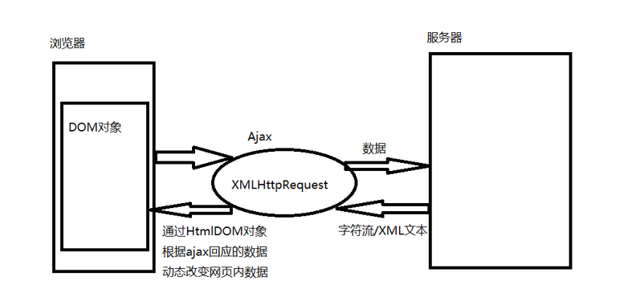

# servlet的生命周期详解

大多数程序员都知道Servlet的生命周期，简单的概括这就分为四步：servlet类加载--->实例化--->服务--->销 毁。对这个过程只是肤浅了解下，对于servlet何时被销毁，还是不太情楚。下面我们描述一下Tomcat与Servlet是如何工作的,首先看下面的 时序图.


1、Web Client 向Servlet容器（Tomcat）发出Http请求

2、Servlet容器接收Web Client的请求

3、Servlet容器创建一个HttpRequest对象，将Web Client请求的信息封装到这个对象中

4、Servlet容器创建一个HttpResponse对象

5、Servlet容器调用HttpServlet对象的service方法，把HttpRequest对象与HttpResponse对象作为参数

   传给 HttpServlet对象

6、HttpServlet调用HttpRequest对象的有关方法，获取Http请求信息

7、HttpServlet调用HttpResponse对象的有关方法，生成响应数据

8、Servlet容器把HttpServlet的响应结果传给Web Client


Servlet的框架是由两个Java包组成的：***javax.servlet***与 ***javax.servlet.http***。在javax.servlet包中定义了所有的Servlet类都必须实现或者扩展的通用接口和类。在 javax.servlet.http包中定义了采用Http协议通信的HttpServlet类。Servlet的框架的核心是 ***javax.servlet.Servlet***接口，所有的Servlet都必须实现这个接口。

在Servlet接口中定义了5个方法，

**其中3个方法代表了Servlet的生命周期（说出这三个方法即可）：**

1、init方法：负责初始化Servlet对象。

2、service方法：负责响应客户的请求。

3、destroy方法：当Servlet对象退出生命周期时，负责释放占用的资源。

# Jsp和Servlet的区别

jsp和servlet的区别和联系：

 ***1.jsp经编译后就变成了Servlet.***
 (JSP的本质就是Servlet，JVM只能识别java的类，不能识别JSP的代码,Web容器将JSP的代码编译成JVM能够识别的java类)

 ***2.jsp更擅长表现于页面显示,servlet更擅长于逻辑控制.***

 ***3.Servlet中没有内置对象，Jsp中的内置对象都是必须通过HttpServletRequest对象，HttpServletResponse对象以及HttpServlet对象得到.***
 Jsp是Servlet的一种简化，使用Jsp只需要完成程序员需要输出到客户端的内容，Jsp中的Java脚本如何镶嵌到一个类中，由Jsp容器完成。
 而Servlet则是个完整的Java类，这个类的Service方法用于生成对客户端的响应。

 ***联系：*** 
 JSP是Servlet技术的扩展，本质上就是Servlet的简易方式。JSP编译后是“类servlet”。
 Servlet和JSP最主要的不同点在于：
 Servlet的应用逻辑是在Java文件中，并且完全从表示层中的HTML里分离开来。
 而JSP的情况是Java和HTML可以组合成一个扩展名为.jsp的文件。
 JSP侧重于视图，Servlet主要用于控制逻辑
 Servlet更多的是类似于一个Controller，用来做控制。

***1、不同之处在哪？***

Servlet在Java代码中通过HttpServletResponse对象动态输出HTML内容

JSP在静态HTML内容中嵌入Java代码，Java代码被动态执行后生成HTML内容

***2、各自的特点***

Servlet能够很好地组织业务逻辑代码，但是在Java源文件中通过字符串拼接的方式生成动态HTML内容会导致代码维护困难、可读性差

JSP虽然规避了Servlet在生成HTML内容方面的劣势，但是在HTML中混入大量、复杂的业务逻辑同样也是不可取的

***3、通过MVC双剑合璧***

既然JSP和Servlet都有自身的适用环境，那么能否扬长避短，让它们发挥各自的优势呢？答案是肯定的——MVC(Model-View-Controller)模式非常适合解决这一问题。


***4.3 Jsp内置对象：***

​    JSP中一共预先定义了9个这样的对象，分别为：request、response、session、application、out、pagecontext、config、page、exception

# jdbc操作数据库的步骤是什么，为什么要使用PreparedStatement

第一步：Class.forName()加载数据库连接驱动； 

第二步：DriverManager.getConnection()获取数据连接对象; 

第三步：根据 SQL 获取 sql 会话对象，有 2 种方式 Statement、PreparedStatement ; 

第四步：执行 SQL 处理结果集，执行 SQL 前如果有参数值就设置参数值 setXXX(); 

第五步：关闭结果集、关闭会话、关闭连接。

***使用PreparedStatement的原因：***

1、 PreparedStatement 接口继承 Statement， PreparedStatement 实例包含已编译的 SQL 语句，所以其执行**速度要快**于 Statement 对象。 

2 、 作 为 Statement 的 子 类 ， PreparedStatement 继 承 了 Statement 的 所 有 功 能 。 三 种 方

法 execute、 executeQuery 和 executeUpdate 已被更改以使之不再需要参数 

3、在 JDBC 应用中,在任何时候都不要使用 Statement，原因如下：  

一、代码的可读性和可维护性.Statement 需要不断地拼接，而 PreparedStatement 不会。 

二、    PreparedStatement 尽最大可能提高性能.DB 有缓存机制，相同的预编译语句再次被调用不会再次需要编译。  

三、    最重要的一点是极大地提高了安全性.Statement 容易被 **SQL 注入**，而 PreparedStatementc 传入的内容不会和 sql 语句发生任何匹配关系。

# 会话跟踪技术有哪些

由于HTTP协议本身是无状态的，服务器为了区分不同的用户，就需要对用户会话进行跟踪，简单的说就是为用户进行登记，为用户分配唯一的ID，下一次用户在请求中包含此ID，服务器据此判断到底是哪一个用户。 
 ①URL 重写：在URL中添加用户会话的信息作为请求的参数，或者将唯一的会话ID添加到URL结尾以标识一个会话。 
 ②设置表单隐藏域：将和会话跟踪相关的字段添加到隐式表单域中，这些信息不会在浏览器中显示但是提交表单时会提交给服务器。 
 这两种方式很难处理跨越多个页面的信息传递，因为如果每次都要修改URL或在页面中添加隐式表单域来存储用户会话相关信息，事情将变得非常麻烦。 

 ③cookie：cookie有两种，

​					一种是基于窗口的，浏览器窗口关闭后，cookie就没有了；

​					另一种是将信息存储在一个临时文件中，并设置存在的时间。

当用户通过浏览器和服务器建立一次会话后，会话ID就会随响应信息返回存储在基于窗口的cookie中，那就意味着只要浏览器没有关闭，会话没有超 时，下一次请求时这个会话ID又会提交给服务器让服务器识别用户身份。会话中可以为用户保存信息。会话对象是在服务器内存中的，而基于窗口的cookie 是在客户端内存中的。如果浏览器禁用了cookie，那么就需要通过上面两种方式进行会话跟踪。

​         ***当然，在使用cookie时要注意几点：首先不要在 cookie中存放敏感信息；其次cookie存储的数据量有限（4k），不能将过多的内容存储cookie中；再者浏览器通常只允许一个站点最多存放 20个cookie。当然，和用户会话相关的其他信息（除了会话ID）也可以存在cookie方便进行会话跟踪。*** 

 ④HttpSession：在所有会话跟踪技术中，HttpSession对象是最强大也是功能最多的。当一个用户第一次访问某个网站时会自动创建 HttpSession，每个用户可以访问他自己的HttpSession。可以通过HttpServletRequest对象的getSession方 法获得HttpSession，通过HttpSession的setAttribute方法可以将一个值放在HttpSession中，通过调用 HttpSession对象的getAttribute方法，同时传入属性名就可以获取保存在HttpSession中的对象。与上面三种方式不同的 是，HttpSession放在服务器的内存中，因此不要将过大的对象放在里面，即使目前的Servlet容器可以在内存将满时将HttpSession 中的对象移到其他存储设备中，但是这样势必影响性能。添加到HttpSession中的值可以是任意Java对象，这个对象最好实现了 Serializable接口，这样Servlet容器在必要的时候可以将其序列化到文件中，否则在序列化时就会出现异常

# Cookie和Session的区别

1、cookie数据存放在客户的浏览器上，session数据放在服务器上。

2、cookie不是很安全，别人可以分析存放在本地的COOKIE并进行COOKIE欺骗
  考虑到安全应当使用session。

3、session会在一定时间内保存在服务器上。当访问增多，会比较占用你服务器的性能
  考虑到减轻服务器性能方面，应当使用COOKIE。

4、单个cookie保存的数据不能超过4K，很多浏览器都限制一个站点最多保存20个cookie。

5、所以个人建议：
  		将登陆信息等重要信息存放为SESSION
  		其他信息如果需要保留，可以放在COOKIE中

# Ajax

AJAX = Asynchronous JavaScript and XML（异步的 JavaScript 和 XML）。

AJAX 不是新的编程语言，而是一种使用现有标准的新方法。

AJAX 是与服务器交换数据并更新部分网页的艺术，在不重新加载整个页面的情况下

AJAX就是通过浏览器的内置对象**XHMHttpResquest**来发送异步请求的，异步请求不会妨碍客户端的任何操作。



—XMLHTTPRequest对象，（是对象，就有属性和方法）

—常用的方法：open("method", "url", "async")，

method表示通过什么方式进行服务器访问，包括get和post；

url表示访问服务器的地址；

async表示是否异步，包括true和false（注意：true表示异步）。

send(content)，

content表示向服务器发送的数据。

—常用的属性：先看一下简单的代码

```html
var xhr = new XMLHTTPRequest();

xhr.open("method", "url", "async");

xhr.send(null);

xhr.onreadystatechange = function(){

	if(xhr.readystate == 4){

		if(xhr.status == 200){

			console.log(xhr.responseText)

		}

	}

}
```

**下面进行说明**

**1.** **向服务器请求状态的阶段：**

**onreadystatechange**表示请求状态改变的事件触发器，

**readystate**表示请求状态，4表示完成，

**2.** **服务器反馈阶段：**

**status**表示http请求状态码，200表示成功，具体如下表：


**3.** **服务器反馈的内容：（数据）**

**responseText**表示响应返回的文本，具体如下表：


# get和post的区别

|                  | get                                                          |                                                         post |
| ---------------- | ------------------------------------------------------------ | -----------------------------------------------------------: |
| 后退按钮/刷新    | 无害                                                         |       数据会被重新提交（浏览器应该告知用户数据会被重新提交） |
| 书签             | 可收藏为书签                                                 |                                               不可收藏为书签 |
| 历史             | 参数保留在浏览器历史中。                                     |                                 参数不会保存在浏览器历史中。 |
| 对数据长度的限制 | 只允许 ASCII 字符。                                          |                                 没有限制。也允许二进制数据。 |
| 安全性           | 与 POST 相比，GET 的安全性较差，因为所发送的数据是 URL 的一部分。  在发送密码或其他敏感信息时绝不要使用GET ！ | POST 比 GET 更安全，因为参数不会被保存在浏览器历史或 web 服务器日志中。 |
| 可见性           | 数据在 URL 中对所有人都是可见的。                            |                                      数据不会显示在 URL 中。 |

# 转发（forward）和重定向（redirect）的区别

转发是服务器行为，重定向是客户端行为。

转发（Forword）通过RequestDispatcher对象的forward（HttpServletRequest request,HttpServletResponse response）方法实现的。RequestDispatcher可以通过HttpServletRequest 的getRequestDispatcher()方法获得。例如下面的代码就是跳转到login_success.jsp页面。

  ` request.getRequestDispatcher("login_success.jsp").forward(request, response);`

重定向（Redirect） 是利用服务器返回的状态吗来实现的。客户端浏览器请求服务器的时候，服务器会返回一个状态码。服务器通过HttpServletRequestResponse的setStatus(int status)方法设置状态码。如果服务器返回301或者302，则浏览器会到新的网址重新请求该资源。

***从地址栏显示来说***

forward是服务器请求资源,服务器直接访问目标地址的URL,把那个URL的响应内容读取过来,然后把这些内容再发给浏览器.浏览器根本不知道服务器发送的内容从哪里来的,所以它的地址栏还是原来的地址.

redirect是服务端根据逻辑,发送一个状态码,告诉浏览器重新去请求那个地址.所以地址栏显示的是新的URL.

***从数据共享来说***

forward:转发页面和转发到的页面可以共享request里面的数据.

redirect:不能共享数据.

***从运用地方来说***

forward:一般用于用户登陆的时候,根据角色转发到相应的模块.

redirect:一般用于用户注销登陆时返回主页面和跳转到其它的网站等

***从效率来说***

forward:高.；redirect:低.

# Httpclient

***Httpclient是什么***

HttpClient HttpClient 是 Apache Jakarta Common 下的子项目。它是一个客户端的HTTP通信实现库。HttpClient的目标是发送和接收HTTP报文。HttpClient不会去缓存内容，执行嵌入在HTML页面中的javascript代码，猜测内容类型，重新格式化请求/重定向URI，或者其它和HTTP运输无关的功能.***它主要就是支持HTTP传输协议的.***

简单来讲：httpclient就是用java代码发送http请求（开发中一般用来调用接口）

***Httpclient的使用***

我们知道，HTTP协议的连接方法有GET、POST、PUT和HEAD方式，在创建Method实例的时候可以更具具体的方法来创建。HttpClient的使用一般分如下几步：

　　1、创建HttpClient实例。

　　2、创建具体连接方法的实例。如POST方法创建PostMethod的实例，在实例化时从构造函数中传入待连接的URL地址。

　　3、对post的发送内容等信息进行配置

　　4、执行HttpClient的execute方法

5、如果返回的状态码正常，表明连接成功，可以读取response的内容

# MVC各个部分都有哪些技术来实现？如何实现

MVC是Model-View-Controller的简写。

Model代表的是应用的业务逻辑（通过Java Bean，EJB组件实现）。

View是应用的表示面（由JSP页面产生）。

Controller是提供应用的处理过程控制（一般是一个Servlet），通过这种设计模型把应用逻辑，处理过程和显示逻辑分成不同的组件实现，这些组件可以进行交互和重用。

# 在浏览器中输入地址后处理过程

1、浏览器根据域名查询域名对应的服务器的IP地址。

​    根据域名查询IP地址的顺序如下：

​	浏览器DNS >>> 操作系统DNS缓存 >>> 本地（ISP）域名服务器缓存 >>> 根域名服务器。

​	在请求到根域名服务器之后，根域名服务器告诉本地域名服务器，下一次应查询的顶级域名服务器dns.com的IP	地址。

​	本地域名服务器向顶级域名服务器dns.com进行查询，顶级域名服务器dns.com告诉本地域名服务器，下一步应	查询的权限服务器dns.abc.com的IP地址。

​	本地域名服务器向权限域名服务器dns.abc.com进行查询，权限域名服务器dns.abc.com告诉本地域名服务器，	所查询的主机的IP地址。

2、浏览器主机根据IP地址与服务器建立TCP连接。

​	建立TCP连接需要进行三次握手。（net部分有详细讲解）

  （1）浏览器主机 >>> 服务器：SYN=1，ACK=0，seq=x；

  （2）服务器 >>> 浏览器主机：SYN=1，ACK=1，seq=y，ack=y+1;

  （3）浏览器主机 >>> 服务器：ACK=1，seq=x+1，ack=y+1。

3、浏览器将访问请求封装为一个HTTP请求报文，通过TCP协议发送给服务器。

​	HTTP请求报文的方法是get方式；如果浏览器存储了该域名下的Cookies，那么会把Cookies放入HTTP请求头里	发给服务器

4、服务器收到请求并响应，生成一个HTTP响应报文，通过TCP协议发送给浏览器主机。

​	HTTP响应报文的头部包含了状态码（Status-Code），三位数字，有5大类。HTTP响应报文内容则是网页的编	码内容。

5、浏览器得到响应报文之后，对响应报文进行解析。

​	在浏览器没有完整接受全部HTML文档时，它就已经开始显示这个页面了。如果是个静态的页面，那到此就基本	结束了。如果是是动态的，那么在浏览器显示HTML时，会获取嵌入在HTML中的对象，浏览器会发送获取请求	来重新获得这些文件。

6、浏览器异步请求其他资源。

​	在分析HTML时，若发现网页引用了其他资源，例如：css、图片等，浏览器则发起HTTP请求，得到响应资源。